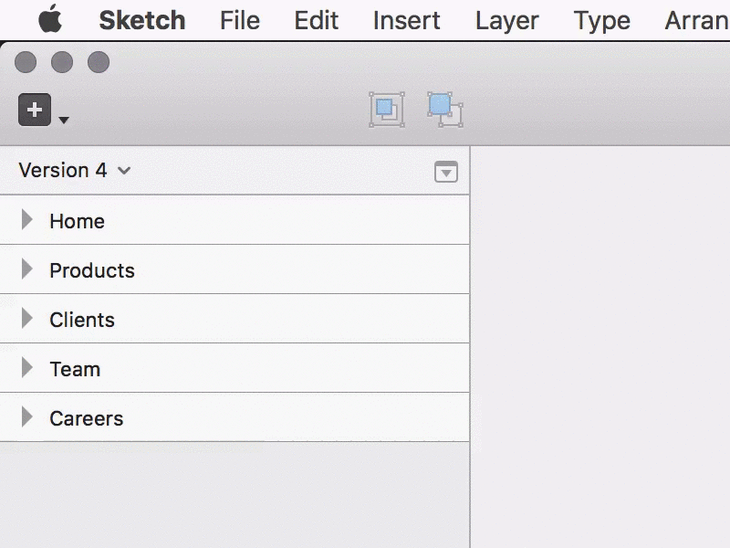

# Sketch Review

Review designs by marking them as `🔴 Pending` or `🔵 Done` with Emoji. 

You can use it from the plugins menu or using the keyboard shortcuts:

- `Select artboard / layer` → `⌘ + P` → Toggles `🔴 Pending` / `🔵 Done`
- `Select artboard / layer` → `⌘ + ALT + P` → Resets the status

## How to install

1. ⬇️ [Download the plugin](https://github.com/marcelinollano/sketch-review/releases/download/1.0/review.sketchplugin.zip)
2. 📦 Extract the `.zip` file
3. ⚡️ Double-click to install
